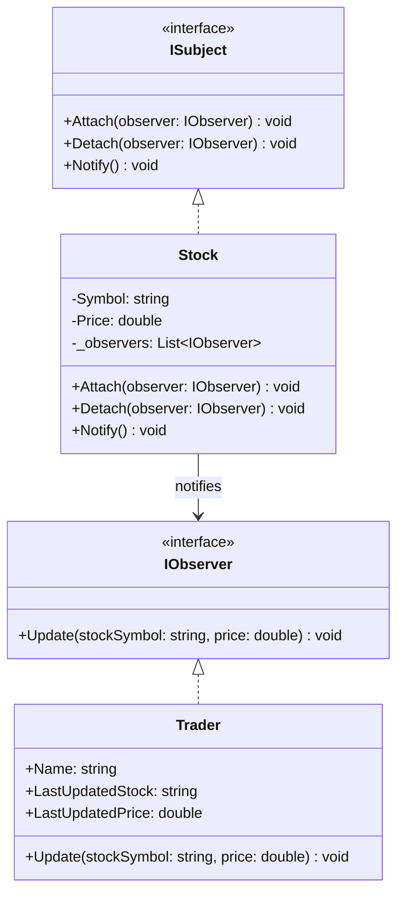

# Implementación del Patrón de Diseño Observer

En esta solución se ha implementado el patrón de diseño de comportamiento **Observer**. 

## Concepto
El patrón Observer permite definir un mecanismo de suscripción para notificar a múltiples objetos (observadores) sobre cualquier evento que le suceda al objeto que están observando (sujeto).

En este ejemplo:
- **Sujeto (`Stock`)**: Representa una acción de la bolsa de valores que cambia su precio.
- **Observador (`Trader`)**: Recibe notificaciones automáticas cuando cambia el precio de la acción.

## Diagrama de Clases (Mermaid)

## Código Implementado

1. **`ISubject.cs`**: Define la interfaz para adjuntar, desadjuntar y notificar observadores.
2. **`IObserver.cs`**: Define la interfaz de actualización de los observadores.
3. **`Stock.cs`**: El sujeto concreto que actualiza su precio y notifica a los observadores adjuntos.
4. **`Trader.cs`**: El observador concreto que registra los cambios de precio.
5. **`ObserverTests.cs`**: Pruebas unitarias que confirman el correcto funcionamiento de las notificaciones.
